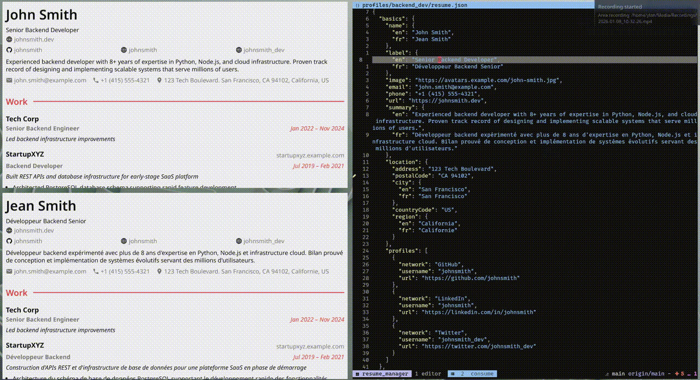

# JSON Resume Management System

Build tailored resumes for different clients and languages from a single source of truth.
Split your resume into manageable JSON fragments, then automatically generate every profile/language variant as PDF.



## Quick Start


You can try it by going into the example folder and running:

```bash
# Build all profiles with all languages (default)
../resume_manager.py
# Or
python resume_manager.py # if available in PATH

# Build a specific profile
resume_manager.py --profile backend_dev

```

### Nvim based workflow

Make sure you have enabled local config in neovim in your init.lua with:

```lua
vim.o.exrc = true
```

Then, opening the example folder and trusting/allowing the local config, you will have autocommands on save for:
- rerendering all pdf's when modifying a json fragment in the profiles folder
- rerendering a particular pdf when modifying a json file in the dist folder for one off modification

## Features

### Translation 
Any field in your resume can be either a primitive value or a language-keyed dictionary.
The script detects which and resolves translations recursively through all nested structures.

```json
{
  "name": { "en": "John Smith", "es": "Jean Smith" },
  "email": "john@example.com",
  "work": [
    {
      "position": { "en": "Senior Engineer", "fr": "Ingenieur Senior" }
    }
  ]
}
```

**Translation Resolution**: Uses requested language → falls back to English → falls back to any available language.


### PDF & JSON Building
Automatically generates both PDF and JSON files with language-specific translations.

- Output: `dist/<profile>/<language>/LASTNAME-FIRSTNAME.{pdf,json}`
- Example: `dist/backend_dev/en/SMITH-JOHN.pdf`

### Automatic Theme Setup
Clones and installs the `jsonresume-theme-awesomish` theme automatically if not found.
Uses pnpm if available otherwise defaults to npm and if neither are present simply builds it up with git manually.

## Directory structure to make it work

```
├── profiles/ # This is where you work
│   ├── backend_dev/
│   │   ├── resume.json
│   │   └── work/
│   │       ├── job0.json
│   │       └── job1.json
│   └── frontend_dev/
│       ├── resume.json
│       └── work/
│           └── ...
├── dist/ # This is the output
│   ├── backend_dev/
│   │   ├── en/
│   │   │   ├── SMITH-JOHN.pdf
│   │   │   └── SMITH-JOHN.json
│   │   └── fr/
│   │       └── ...
│   └── ...
└── resume_manager.py
```

## Installation

### Requirements
- Python 3.8+
- `git`, `npm` or `pnpm` (for theme dependencies)
- `resume-cli` (automatic fallback to `npx resume-cli` if not installed globally)

### Setup
```bash
# Install resume-cli globally (optional, script can use npx)
pnpm install -g resume-cli #opional

# Run the script - it handles everything else
python resume_manager.py
```

## Usage Examples

### Build Everything
```bash
python resume_manager.py
# Builds all profiles with all detected languages
```

### Build Specific Profile
```bash
python resume_manager.py --profile backend_dev
# Builds both en and fr versions if available
```

### Build from Custom Location
```bash
python resume_manager.py /path/to/resume-project
# Looks for profiles/ and creates dist/ in that directory
```

## Testing

Run the test suite:
```bash
pytest tests/ -v
```

## How It Works

1. **Language Detection**: Scans resume structure for dictionaries with 2-letter language codes (en, es, fr, etc.) and primitive values
2. **Work Merging**: Combines all files from `work/` directory, sorted by `startDate` in descending order
3. **Translation Resolution**: For each field, checks if it's a translation dict and applies language fallback logic
4. **PDF Generation**: Merges work files, resolves translations, and generates PDF via resume-cli with the awesomish theme
5. **Naming**: Output files named `LASTNAME-FIRSTNAME.pdf` based on resolved `basics.name` for the target language


## Key Design Decisions

- **Smart Language Fallbacks**: Missing language → English → any available language
- **Automatic Theme Setup**: No manual configuration needed
- **Dual Output**: Every PDF has a matching JSON file with the same name
- **In-Place Translations**: No separate translation files needed
- **Default to All**: Builds all languages automatically (no need for `--all` flag)
- **Simple File Structure**: All `.json` files in `work/` directory are merged, names do not matter

# Legacy features

```bash
# Split work array into individual job files
python resume_manager.py split backend_dev

# Preview merged resume
python resume_manager.py merge backend_dev
```

## Work Section Management

Split your work array into individual job files for easier editing and version control, then merge them back automatically.

- **Split**: `python resume_manager.py split <profile>` → Creates `work/job0.json`, `work/job1.json`, etc.
- **Merge**: `python resume_manager.py merge <profile>` → Combines all jobs sorted by startDate (newest first)


## Manage Work Sections

```bash
# Split work array into individual files
python resume_manager.py split backend_dev
# Creates: profiles/backend_dev/work/job0.json, job1.json, ...

# Preview merged resume with all translations
python resume_manager.py merge backend_dev | jq '.work'
```
